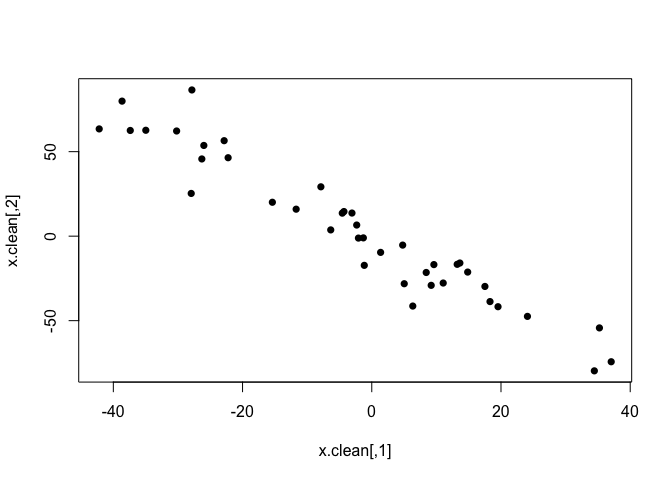
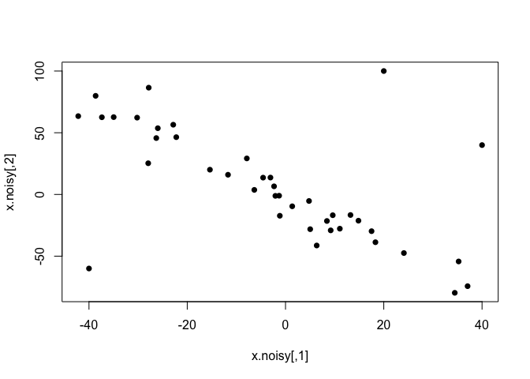
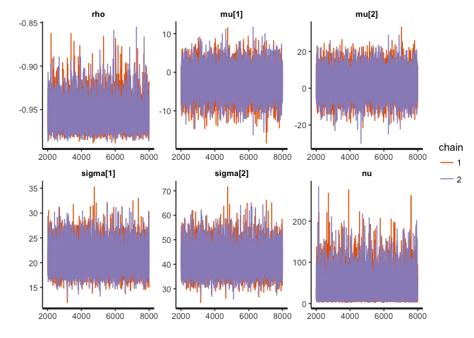
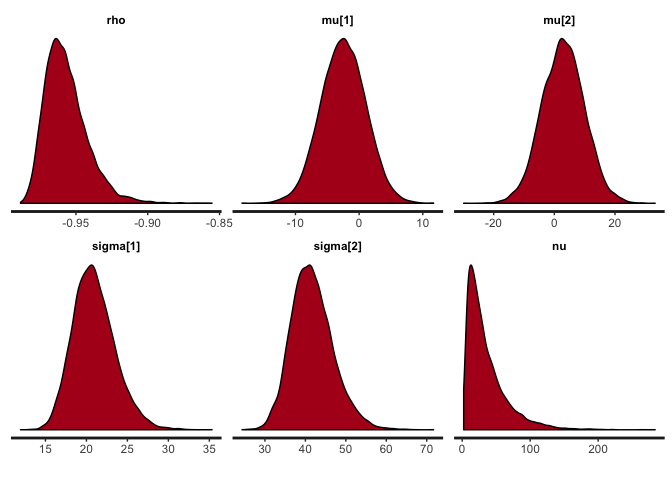
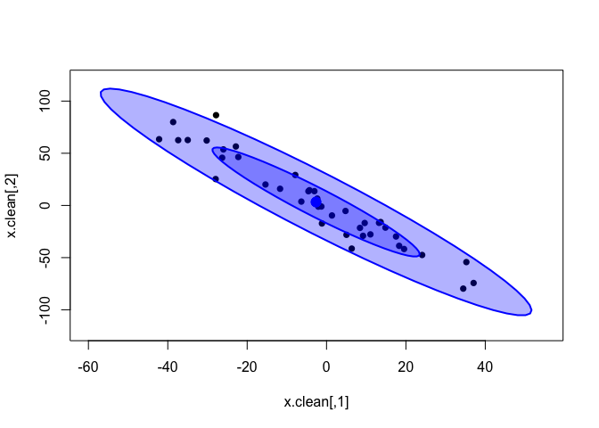
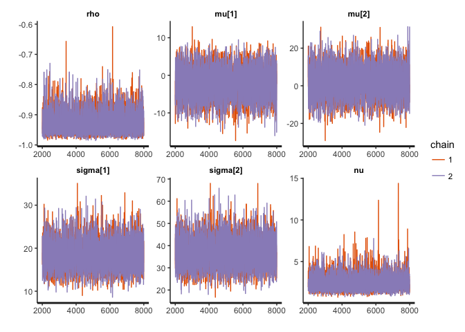
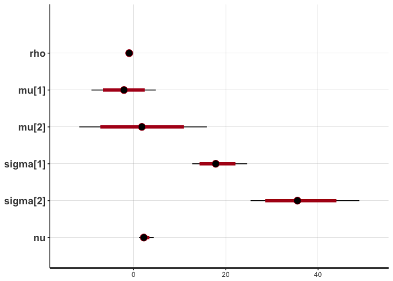
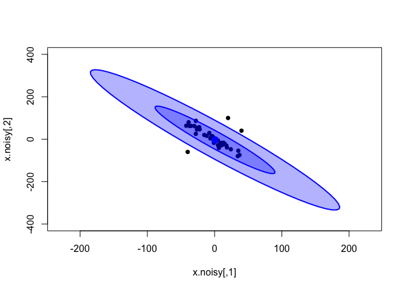
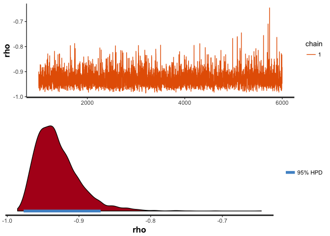

While looking for a Bayesian replacement for my in-house robust correlation method (Spearman's correlation with bootstrap resampling), I found two very interesting posts on [standard](http://www.sumsar.net/blog/2013/08/bayesian-estimation-of-correlation/) and [robust](http://www.sumsar.net/blog/2013/08/robust-bayesian-estimation-of-correlation/) Bayesian correlation models in **Rasmus Bååth**'s blog. As I wanted to give the robust model a try on my own data (and also combine it with a robust regression model) I have translated Bååth's JAGS code into Stan and wrapped it inside a function. Below I show how this model is more suitable than classical correlation coefficients, regardless of whether the data are normally distributed.

As Rasmus Bååth explains in his [first blog post](http://www.sumsar.net/blog/2013/08/bayesian-estimation-of-correlation/) on Bayesian correlation:

> The model that a classical Pearson’s correlation test assumes is that the data follows a bivariate normal distribution. That is, if we have a list *x* of pairs of data points \[\[*x*<sub>1,1</sub>, *x*<sub>1,2</sub>\], \[*x*<sub>2,1</sub>, *x*<sub>2,2</sub>\], \[*x*<sub>3,1</sub>, *x*<sub>3,2</sub>\], ...\] then the *x*<sub>i,1</sub>s and the *x*<sub>i,2</sub>s are each assumed to be normally distributed with a possible linear dependency between them. This dependency is quantified by the correlation parameter *ρ* which is what we want to estimate in a correlation analysis. A good visualization of a bivariate normal distribution with *ρ* = 0.3 can be found on the the wikipedia page on the multivariate normal distribution :
>
> 

The bivariate normal model described later in the same post is equivalent to the classical Pearson's correlation coefficient, and it suffers from the same problems. Because Pearson's correlation assumes that the data come from a bivariate normal distribution (i.e. that the observations for each of the two variables are normally distributed), it is very sensitive to outliers. Since a truly normal distribution cannot accommodate serious outliers, the normal distributions are skewed towards them, which results in a reduction in the estimated correlation coefficient. The usual way to address this when using non-normal data in classical statistics is through Spearman's rank correlation coefficient, which is more robust to outliers. However, Spearman's is not simply a robust version of Pearson's coefficient, but they actually measure different things: while [Pearson's correlation](https://en.wikipedia.org/wiki/Pearson_correlation_coefficient) measures the strength of a *linear* relationship between the two variables, [Spearman's correlation](https://en.wikipedia.org/wiki/Spearman%27s_rank_correlation_coefficient) measures the strength of a *monotonic* relationship between the variables. So there is no truly robust version of Pearson's correlation coefficient available in traditional statistics.

In Bayesian statistics, however, the correlation model can be made robust to outliers quite easily, by replacing the bivariate normal distribution by a bivariate [Student's *t*-distribution](https://en.wikipedia.org/wiki/Student%27s_t-distribution), as Bååth explains in his [second post](http://www.sumsar.net/blog/2013/08/robust-bayesian-estimation-of-correlation/) on Bayesian correlation:

> What you actually often want to assume is that *the bulk* of the data is normally distributed while still allowing for the *occasional* outlier. One of the great benefits of Bayesian statistics is that it is easy to assume any parametric distribution for the data and a good distribution when we want robustness is the t-distribution. This distribution is similar to the normal distribution except that it has an extra parameter *ν* (also called the *degrees of freedom*) that governs how heavy the tails of the distribution are. The smaller *ν* is, the heavier the tails are and the less the estimated mean and standard deviation of the distribution are influenced by outliers. When *ν* is large (say *ν* &gt; 30) the t-distribution is very similar to the normal distribution. So in order to make our Bayesian correlation analysis more robust we’ll replace the multivariate normal distribution from the last post with a multivariate t-distribution. To that we’ll add a prior on the *ν* parameter `nu` that both allows for completely normally distributed data or normally distributed data with an occasional outlier.

Adopting a multivariate *t*-distribution with a vague prior on its degrees of freedom makes Bååth's robust model inherently adaptable to the level of noise. That is, if the data are strictly normal, `nu` will be estimated to be very large, and the model will be equivalent to the one with a bivariate normal distribution; but if the data are noisy, then `nu` will be estimated to an appropriately small value, and the resulting multivariate *t*-distribution will inherently incorporate the outliers in the data without this having an effect on the correlation coefficient. This is very nicely shown in Bååth's [post](http://www.sumsar.net/blog/2013/08/robust-bayesian-estimation-of-correlation/), but I will illustrate it below using the Stan version of his model.

Let's try the model on some artificial correlated data in R. We will need the following packages:

``` r
library(rstan)    # to run the Bayesian model (stan)
library(coda)     # to obtain HPD intervals (HPDinterval)
library(mvtnorm)  # to generate random correlated data (rmvnorm)
library(car)      # to plot the inferred distribution (dataEllipse)
```

We can generate random data from a multivariate normal distribution with pre-specified correlation (`rho`) using the `rmvnorm` function in the `mvtnorm` package. The covariance matrix is constructed as explained in Rasmus Bååth's [post](http://www.sumsar.net/blog/2013/08/bayesian-estimation-of-correlation/).

``` r
sigma = c(20, 40)
rho = -0.95
cov.mat = matrix(c(sigma[1] ^ 2,
                   sigma[1] * sigma[2] * rho,
                   sigma[1] * sigma[2] * rho,
                   sigma[2] ^ 2),
                 nrow=2, byrow=T)

set.seed(210191)
x.clean = rmvnorm(n=40, sigma=cov.mat)
plot(x.clean, pch=16)
```



Let's first take a look at the classical correlation coefficients (Pearson's and Spearman's) on these data.

``` r
cor(x.clean, method="pearson")[1, 2]
```

    ## [1] -0.959702

``` r
cor(x.clean, method="spearman")[1, 2]
```

    ## [1] -0.9581614

These data are a bit too clean for my taste, so let's introduce some extreme outliers.

``` r
x.noisy = x.clean
x.noisy[1:3,] = matrix(c(-40, -60,
                         20, 100,
                         40, 40),
                       nrow=3, byrow=T)
plot(x.noisy, pch=16)
```



Now, classical methods are not happy with this kind of non-normal outliers, and both correlation coefficients decrease. While Pearson's correlation is more sensitive, these outliers are extreme enough to have a large impact on Spearman's as well.

``` r
cor(x.noisy, method="pearson")[1, 2]
```

    ## [1] -0.6365649

``` r
cor(x.noisy, method="spearman")[1, 2]
```

    ## [1] -0.6602251

Now, as Bååth explained, we would like a model that is able to recognise the linear correlation in the bulk of the data, while accounting for the outliers as infrequent observations. The *t*-distribution does this naturally and dynamically, as long as we treat the degrees of freedom (`nu`) as a parameter with its own prior distribution.

The code for my Stan version of Bååth's multivariate *t* model is reproduced below, and can be found in the file [`robust_correlation.stan`](https://github.com/baezortega/bayes/blob/master/robust_correlation/robust_correlation.stan). Suitable vague priors are defined for all model parameters (for details about the prior on `nu`, see the related post in [John Kruschke's blog](http://doingbayesiandataanalysis.blogspot.co.uk/2015/12/prior-on-df-normality-parameter-in-t.html).)

    data {
        int<lower=1> N;  // number of observations
        matrix[N, 2] x;  // input data: rows are observations, columns are the two variables
    }

    parameters {
        vector[2] mu;                 // locations of the marginal t distributions
        real<lower=0> sigma[2];       // scales of the marginal t distributions
        real<lower=0> nu;             // degrees of freedom of the marginal t distributions
        real<lower=-1, upper=1> rho;  // correlation coefficient
        vector[2] x_rand;             // random samples from the bivariate t distribution
    }

    transformed parameters {
        // Covariance matrix
        cov_matrix[2] cov = [[      sigma[1] ^ 2       , sigma[1] * sigma[2] * rho],
                             [sigma[1] * sigma[2] * rho,       sigma[2] ^ 2       ]];
    }

    model {
        // Likelihood
        // Bivariate Student's t-distribution instead of normal for robustness
        for (n in 1:N) {
            x[n] ~ multi_student_t(nu, mu, cov);
        }
        
        // Uninformative priors on all parameters
        sigma ~ uniform(0, 100000);
        rho ~ uniform(-1, 1);
        mu ~ normal(0, 100000);
        nu ~ exponential(1/30.0);
        
        // Draw samples from the estimated bivariate t-distribution (for assessment of fit)
        x_rand ~ multi_student_t(nu, mu, cov);
    }

Now, let's first run the model on the clean data. The time this takes will depend on the number of iterations and chains we use, but it shouldn't be long. (Note that the model has to be compiled the first time it is run. Some unimportant warning messages might show up during compilation, before MCMC sampling starts.)

``` r
# Set up model data
data.clean = list(x=x.clean, N=nrow(x.clean))

# Use robust estimates of the parameters as initial values
init.clean = list(mu = apply(data.clean$x, 2, median),
                  sigma = apply(data.clean$x, 2, mad),
                  rho = cor(data.clean$x, method="spearman")[1, 2])

# Run the model
cor.clean = stan(file="robust_correlation.stan", 
                 data=data.clean, init=rep(list(init.clean), 2), 
                 seed=210191, iter=8000, warmup=2000, chains=2)
```

    ## 
    ## SAMPLING FOR MODEL 'robust_correlation' NOW (CHAIN 1).
    ## 
    ## Gradient evaluation took 0.000245 seconds
    ## 1000 transitions using 10 leapfrog steps per transition would take 2.45 seconds.
    ## Adjust your expectations accordingly!
    ## 
    ## 
    ## Iteration:    1 / 8000 [  0%]  (Warmup)
    ## Iteration:  800 / 8000 [ 10%]  (Warmup)
    ## Iteration: 1600 / 8000 [ 20%]  (Warmup)
    ## Iteration: 2001 / 8000 [ 25%]  (Sampling)
    ## Iteration: 2800 / 8000 [ 35%]  (Sampling)
    ## Iteration: 3600 / 8000 [ 45%]  (Sampling)
    ## Iteration: 4400 / 8000 [ 55%]  (Sampling)
    ## Iteration: 5200 / 8000 [ 65%]  (Sampling)
    ## Iteration: 6000 / 8000 [ 75%]  (Sampling)
    ## Iteration: 6800 / 8000 [ 85%]  (Sampling)
    ## Iteration: 7600 / 8000 [ 95%]  (Sampling)
    ## Iteration: 8000 / 8000 [100%]  (Sampling)
    ## 
    ##  Elapsed Time: 21.4311 seconds (Warm-up)
    ##                33.0252 seconds (Sampling)
    ##                54.4563 seconds (Total)
    ## 
    ## 
    ## SAMPLING FOR MODEL 'robust_correlation' NOW (CHAIN 2).
    ## 
    ## Gradient evaluation took 0.00028 seconds
    ## 1000 transitions using 10 leapfrog steps per transition would take 2.8 seconds.
    ## Adjust your expectations accordingly!
    ## 
    ## 
    ## Iteration:    1 / 8000 [  0%]  (Warmup)
    ## Iteration:  800 / 8000 [ 10%]  (Warmup)
    ## Iteration: 1600 / 8000 [ 20%]  (Warmup)
    ## Iteration: 2001 / 8000 [ 25%]  (Sampling)
    ## Iteration: 2800 / 8000 [ 35%]  (Sampling)
    ## Iteration: 3600 / 8000 [ 45%]  (Sampling)
    ## Iteration: 4400 / 8000 [ 55%]  (Sampling)
    ## Iteration: 5200 / 8000 [ 65%]  (Sampling)
    ## Iteration: 6000 / 8000 [ 75%]  (Sampling)
    ## Iteration: 6800 / 8000 [ 85%]  (Sampling)
    ## Iteration: 7600 / 8000 [ 95%]  (Sampling)
    ## Iteration: 8000 / 8000 [100%]  (Sampling)
    ## 
    ##  Elapsed Time: 21.3896 seconds (Warm-up)
    ##                29.7543 seconds (Sampling)
    ##                51.1438 seconds (Total)

We can take a look at the MCMC traces and the posterior distributions for `rho` (the correlation coefficient), `mu`, `sigma` (the locations and scales of the bivariate *t*-distribution), and `nu` (the degrees of freedom).

``` r
stan_trace(cor.clean, pars=c("rho", "mu", "sigma", "nu"))
```



``` r
stan_dens(cor.clean, pars=c("rho", "mu", "sigma", "nu"))
```



``` r
stan_plot(cor.clean, pars=c("rho", "mu", "sigma", "nu"))
```

    ## ci_level: 0.8 (80% intervals)

    ## outer_level: 0.95 (95% intervals)


The traces show convergence of the two MCMC chains, and almost all the weight of the posterior distribution of `rho` lies between -0.90 and -1. The posterior of `nu` covers large values, indicating that the data are normally distributed (remember that a *t*-distribution with high `nu` is equivalent to a normal distribution).

We can see how well the inferred bivariate distribution fits the data by plotting the random samples that the model drew from this distribution (`x_rand` in the model).

``` r
x.rand = extract(cor.clean, c("x_rand"))[[1]]
plot(x.clean, xlim=c(-60, 55), ylim=c(-120, 120), pch=16)
dataEllipse(x.rand, levels = c(0.5, 0.95),
            fill=T, plot.points = FALSE)
```



In the plot above, the dark-blue inner ellipse is the area containing 50% of the posterior distribution, and the pale-blue outer ellipse is the area containing 95% of the distribution.

It seems that the distribution inferred by the model does fit the data quite well. Now, this was expected for such eerily clean data. Let's try on the noisy data; remember that the classical correlations were strongly affected by the introduced outliers.

``` r
cor(x.noisy, method="pearson")[1, 2]
```

    ## [1] -0.6365649

``` r
cor(x.noisy, method="spearman")[1, 2]
```

    ## [1] -0.6602251

We run the model on the noisy data as before.

``` r
# Set up model data
data.noisy = list(x=x.noisy, N=nrow(x.noisy))

# Use robust estimates of the parameters as initial values
init.noisy = list(mu = apply(data.noisy$x, 2, median),
                  sigma = apply(data.noisy$x, 2, mad),
                  rho = cor(data.noisy$x, method="spearman")[1, 2])

# Run the model
cor.noisy = stan(file="robust_correlation.stan", 
                 data=data.noisy, init=rep(list(init.noisy), 2), 
                 seed=210191, iter=8000, warmup=2000, chains=2)
```

    ## 
    ## SAMPLING FOR MODEL 'robust_correlation' NOW (CHAIN 1).
    ## 
    ## Gradient evaluation took 0.000296 seconds
    ## 1000 transitions using 10 leapfrog steps per transition would take 2.96 seconds.
    ## Adjust your expectations accordingly!
    ## 
    ## 
    ## Iteration:    1 / 8000 [  0%]  (Warmup)
    ## Iteration:  800 / 8000 [ 10%]  (Warmup)
    ## Iteration: 1600 / 8000 [ 20%]  (Warmup)
    ## Iteration: 2001 / 8000 [ 25%]  (Sampling)
    ## Iteration: 2800 / 8000 [ 35%]  (Sampling)
    ## Iteration: 3600 / 8000 [ 45%]  (Sampling)
    ## Iteration: 4400 / 8000 [ 55%]  (Sampling)
    ## Iteration: 5200 / 8000 [ 65%]  (Sampling)
    ## Iteration: 6000 / 8000 [ 75%]  (Sampling)
    ## Iteration: 6800 / 8000 [ 85%]  (Sampling)
    ## Iteration: 7600 / 8000 [ 95%]  (Sampling)
    ## Iteration: 8000 / 8000 [100%]  (Sampling)
    ## 
    ##  Elapsed Time: 20.3796 seconds (Warm-up)
    ##                35.4029 seconds (Sampling)
    ##                55.7825 seconds (Total)
    ## 
    ## 
    ## SAMPLING FOR MODEL 'robust_correlation' NOW (CHAIN 2).
    ## 
    ## Gradient evaluation took 0.000348 seconds
    ## 1000 transitions using 10 leapfrog steps per transition would take 3.48 seconds.
    ## Adjust your expectations accordingly!
    ## 
    ## 
    ## Iteration:    1 / 8000 [  0%]  (Warmup)
    ## Iteration:  800 / 8000 [ 10%]  (Warmup)
    ## Iteration: 1600 / 8000 [ 20%]  (Warmup)
    ## Iteration: 2001 / 8000 [ 25%]  (Sampling)
    ## Iteration: 2800 / 8000 [ 35%]  (Sampling)
    ## Iteration: 3600 / 8000 [ 45%]  (Sampling)
    ## Iteration: 4400 / 8000 [ 55%]  (Sampling)
    ## Iteration: 5200 / 8000 [ 65%]  (Sampling)
    ## Iteration: 6000 / 8000 [ 75%]  (Sampling)
    ## Iteration: 6800 / 8000 [ 85%]  (Sampling)
    ## Iteration: 7600 / 8000 [ 95%]  (Sampling)
    ## Iteration: 8000 / 8000 [100%]  (Sampling)
    ## 
    ##  Elapsed Time: 17.7129 seconds (Warm-up)
    ##                48.1511 seconds (Sampling)
    ##                65.864 seconds (Total)

``` r
# Plot traces and posteriors
stan_trace(cor.noisy, pars=c("rho", "mu", "sigma", "nu"))
```



``` r
stan_dens(cor.noisy, pars=c("rho", "mu", "sigma", "nu"))
```


``` r
stan_plot(cor.noisy, pars=c("rho", "mu", "sigma", "nu"))
```

    ## ci_level: 0.8 (80% intervals)

    ## outer_level: 0.95 (95% intervals)



The posterior distribution of `rho` hasn't changed that much, but notice the difference in the posterior of `nu`. Lower values of `nu` indicate that the inferred bivariate *t*-distribution has heavy tails this time (i.e. is far from normality), in order to accommodate the outliers. If this noise were not accommodated in `nu` (e.g. if we used a normal distribution), then it would have to be accommodated in the distribution of `rho`, thus strongly biasing the correlation estimates.

Now, let's see how the inferred bivariate *t*-distribution fits the noisy data.

``` r
x.rand = extract(cor.noisy, c("x_rand"))[[1]]
plot(x.noisy, xlim=c(-230, 230), ylim=c(-400, 400), pch=16)
dataEllipse(x.rand, levels = c(0.5, 0.95),
            fill=T, plot.points = FALSE)
```



The bivariate *t*-distribution seems to have a similar fit than the one inferred from the clean data; its slope is not affected by the outliers. However, notice how the tails of the distribution (pale-blue outer ellipse) have grown much wider than before.

Now that we have seen how the model provides robust estimation of the correlation coefficient, it would be good to take a good look at the estimated `rho`. Let's extract the MCMC samples for this parameter's posterior from the `cor.noisy` object produced by the `stan` function.

``` r
rho.noisy = as.numeric(extract(cor.noisy, "rho")[[1]])
length(rho.noisy)  # number of MCMC samples
```

    ## [1] 12000

``` r
mean(rho.noisy)    # posterior mean
```

    ## [1] -0.9302644

``` r
HPDinterval(as.mcmc(rho.noisy), prob=0.99)  # 99% highest posterior density interval
```

    ##           lower      upper
    ## var1 -0.9822283 -0.8269327
    ## attr(,"Probability")
    ## [1] 0.99

`rho` has a posterior mean of -0.93 and a 99% highest posterior density (HPD) interval of \[-0.98, -0.83\] (i.e. 99% of its posterior probability lies within this interval). The posterior mean is very close to the original `rho = -0.95` that we used to generate the data, reflecting the model's robustness. But an important point here is that we can obtain these posterior statistics (and many more) by looking directly at the MCMC samples. Having **direct access to the posterior distribution** of the parameter(s) we are interested in (in this case, the correlation coefficient) means that we don't have to resort to null hypothesis testing to assess the certainty of our estimate.

For example, let's run a standard correlation test on the noisy data.

``` r
cor.test(x.noisy[,1], x.noisy[,2], method="pearson")
```

    ## 
    ##  Pearson's product-moment correlation
    ## 
    ## data:  x.noisy[, 1] and x.noisy[, 2]
    ## t = -5.0881, df = 38, p-value = 1.008e-05
    ## alternative hypothesis: true correlation is not equal to 0
    ## 95 percent confidence interval:
    ##  -0.7911854 -0.4054558
    ## sample estimates:
    ##        cor 
    ## -0.6365649

This provides the estimated value for the correlation coefficient (`cor`) together with a *p*-value and a confidence interval. In frequentist statistics, the estimated parameter is assumed to have a fixed, unknown true value, and this `cor = -0.6365649` is the best informed guess of that value. The 95% confidence interval defines a range of likely values where the true value might be, but it is *not* the same as saying that this interval has a 95% probability of containing the true value; since the true value is assumed to be a fixed number, the probability of any interval containing the true value is either 0 or 1. The 95% confidence interval represents something [more convoluted](https://en.wikipedia.org/wiki/Confidence_interval) involving infinite hypothetical repetitions of the same analysis using different data samples.

The small *p*-value tells us what is the probability that values such as those in `x.noisy`, or even more strongly correlated, could be observed if the null hypothesis (that the true correlation is zero) were correct. In other words, it's the probability that the variables are *not* correlated in reality and what we are seeing is the product of random variation.

So, frequentist correlation tests have a rather indirect way of providing information about the true correlation coefficient. Let's see now what we can say about this from the Bayesian standpoint. In Bayesian statistics, the true value of the parameter of interest is not a fixed quantity, but it has a probability distribution. We can investigate this distribution empirically simply by looking at the MCMC samples.

``` r
# Print some posterior statistics
# Posterior mean of rho:
mean(rho.noisy)
```

    ## [1] -0.9302644

``` r
# Rho values with 99% posterior probability:
hpd99 = HPDinterval(as.mcmc(rho.noisy), prob=0.99)
cat("[", hpd99[,"lower"], ", ", hpd99[,"upper"], "]", sep="")
```

    ## [-0.9822283, -0.8269327]

``` r
# Posterior probability that rho is ≤0: P(rho ≤ 0)
mean(rho.noisy <= 0)
```

    ## [1] 1

``` r
# Posterior probability that rho is ≥0: P(rho ≥ 0)
mean(rho.noisy >= 0)
```

    ## [1] 0

``` r
# Posterior probability that rho is <-0.5: P(rho < -0.5)
mean(rho.noisy < -0.5)
```

    ## [1] 1

``` r
# Posterior probability that rho is small: P(-0.1 < rho < 0.1)
mean(rho.noisy > -0.1 & rho.noisy < 0.1)
```

    ## [1] 0

This shows how we can directly interrogate the posterior distribution in order to make clear probabilistic statements about the distribution of the true `rho`. A statement like

> *According to the model, the correlation coefficient is between -0.83 and -0.98 with 99% probability*

is somewhat more precise and clear than saying

> *According to the test, we are 95% confident that the correlation coefficient has a value somewhere between -0.41 and -0.79; we don't really **know** if this interval contains the value, but if we could repeat this analysis on infinite different samples, we would be wrong just 5% of the time!*

However, it is important to note that the precision of our posterior estimates will depend on how many iterations of MCMC sampling we perform. For example, note that the probability that `rho` is zero or positive, `P(rho ≥ 0)`, is estimated to be zero. This statement is not entirely accurate, given that we didn't run the model for very long. To increase the precision of our probabilistic statements, we would need to run the model for longer (i.e. sample more MCMC samples), and this would eventually give us a very small (but non-zero) posterior probability for this event. For example, if the actual posterior probability that `rho` is zero or positive were, say, one in a million, then we would need to sample (on average) a million MCMC samples in order to achieve the necessary accuracy. But normally we are not interested in that degree of precision; if we have sampled 12000 MCMC samples, we can at least declare the probability to be smaller than **<sup>1</sup>/<sub>12000</sub>.

Finally, I have wrapped the model itself and the code that runs it inside a function called `rob.cor.mcmc`, which is in the file [`rob.cor.mcmc.R`](https://github.com/baezortega/bayes/blob/master/robust_correlation/rob.cor.mcmc.R). This uses a default of 6000 MCMC iterations and a single chain in order to run faster, but this can be altered using the arguments `iter`, `warmup` and `chains`). This function plots the MCMC trace and posterior distribution for `rho`, prints a handful of basic posterior statistics and returns the same object generated by the `stan` function, from which you can then extract much more information using the `rstan` and `coda` packages.

``` r
source("rob.cor.mcmc.R")
cor.noisy2 = rob.cor.mcmc(x.noisy)
```

    ## 
    ## SAMPLING FOR MODEL 'robust_regression' NOW (CHAIN 1).
    ## 
    ## Gradient evaluation took 0.00022 seconds
    ## 1000 transitions using 10 leapfrog steps per transition would take 2.2 seconds.
    ## Adjust your expectations accordingly!
    ## 
    ## 
    ## Iteration:    1 / 6000 [  0%]  (Warmup)
    ## Iteration:  600 / 6000 [ 10%]  (Warmup)
    ## Iteration: 1001 / 6000 [ 16%]  (Sampling)
    ## Iteration: 1600 / 6000 [ 26%]  (Sampling)
    ## Iteration: 2200 / 6000 [ 36%]  (Sampling)
    ## Iteration: 2800 / 6000 [ 46%]  (Sampling)
    ## Iteration: 3400 / 6000 [ 56%]  (Sampling)
    ## Iteration: 4000 / 6000 [ 66%]  (Sampling)
    ## Iteration: 4600 / 6000 [ 76%]  (Sampling)
    ## Iteration: 5200 / 6000 [ 86%]  (Sampling)
    ## Iteration: 5800 / 6000 [ 96%]  (Sampling)
    ## Iteration: 6000 / 6000 [100%]  (Sampling)
    ## 
    ##  Elapsed Time: 15.7521 seconds (Warm-up)
    ##                30.0936 seconds (Sampling)
    ##                45.8458 seconds (Total)



    ## POSTERIOR STATISTICS OF RHO
    ## Posterior mean and standard deviation:     Mean = -0.9300314, SD = 0.03092218
    ## Posterior median and MAD:                  Median = -0.9354879, MAD = 0.02688227
    ## Rho values with 99% posterior probability: 99% HPDI = [-0.9822679, -0.8285892]
    ## Rho values with 95% posterior probability: 95% HPDI = [-0.9771654, -0.8697989]
    ## Posterior probability that rho is ≤0:      P(rho ≤ 0) = 1
    ## Posterior probability that rho is ≥0:      P(rho ≥ 0) = 0
    ## Posterior probability that rho is weak:    P(-0.1 < rho < 0.1) = 0

------------------------------------------------------------------------
